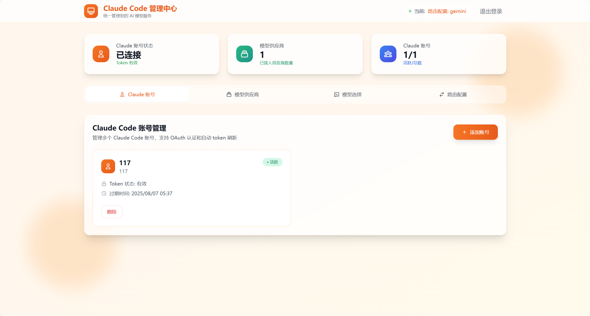
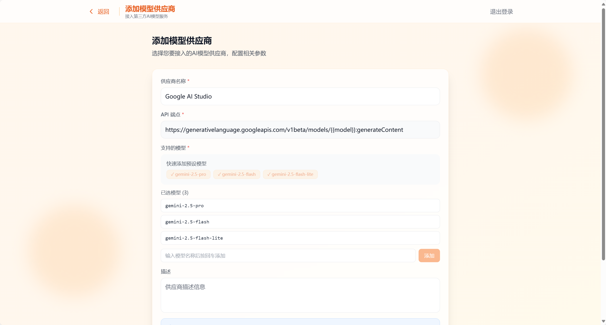
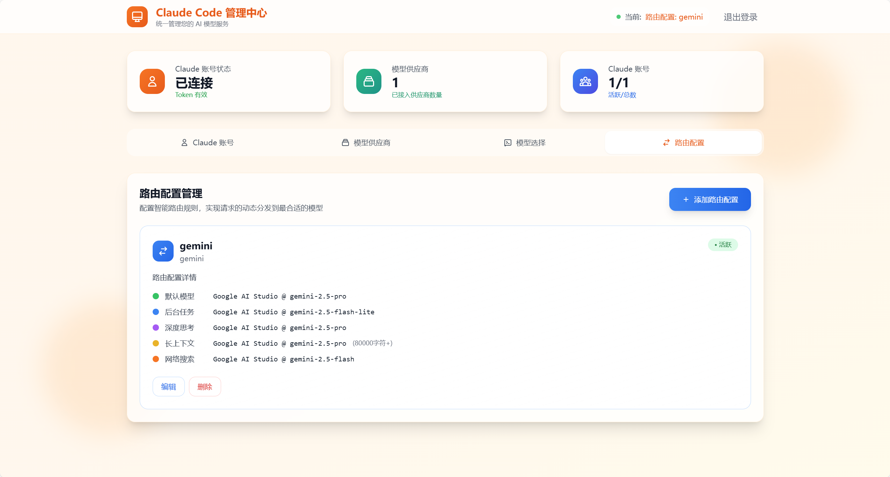
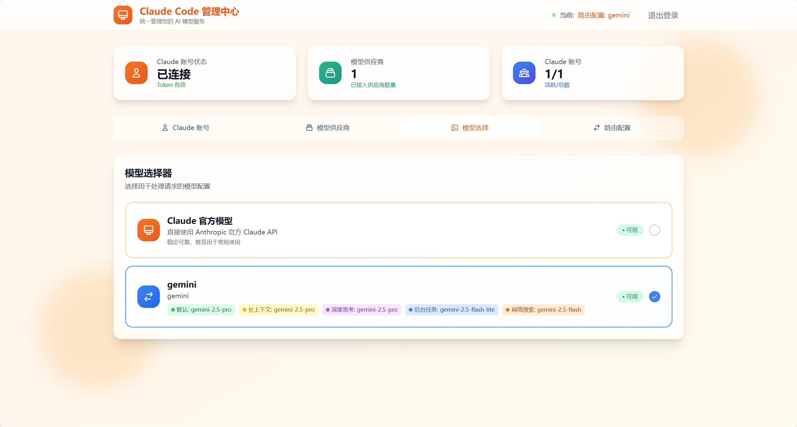

# Claude Relay

🚀 现代化的 Claude API 代理服务，支持官方和第三方 LLM 供应商智能路由，基于 Cloudflare Workers 全球部署。

## ✨ 核心特性

- 🔐 **智能代理** - 官方 Claude + 第三方 LLM（魔搭 Qwen、智谱 AI、Google Gemini）
- 🌐 **全球部署** - Cloudflare Workers 边缘网络，超低延迟
- 💻 **可视化管理** - 现代化 Web 界面，一站式管理所有配置
- 🔑 **企业级密钥池** - 智能轮换、故障恢复、实时监控
- 🚀 **一键部署** - GitHub Actions 自动化部署，零配置启动

## 🎬 功能演示

### 1️⃣ Claude 账号管理
通过 OAuth 认证管理多个 Claude 账号，支持 Token 自动刷新


### 2️⃣ 添加供应商
轻松添加第三方 AI 模型供应商（Google AI Studio、魔搭等）


### 3️⃣ 供应商管理
管理所有第三方模型供应商，支持编辑、删除、密钥池管理


### 4️⃣ Key Pool 管理
企业级密钥池管理：批量导入、状态监控、智能轮换


### 5️⃣ 添加路由配置
配置请求路由策略，设置模型映射关系


### 6️⃣ 查看路由详情
查看供应商的路由配置详情，支持多模型管理


### 7️⃣ 模型选择
灵活切换官方 Claude 和第三方模型，实现智能路由


## 🚀 快速开始

[](https://deploy.workers.cloudflare.com/?url=https://github.com/your-username/claude-relay-monorepo)

### 1️⃣ Fork 仓库 → 2️⃣ 配置 Secrets → 3️⃣ 一键部署

**只需 3 步，5 分钟完成部署！** 👉 [详细部署指南](./docs/deployment.md)

### 立即使用

**管理中心：** `https://your-domain.workers.dev/admin`

**API 端点：** `https://your-domain.workers.dev/v1/messages`

**Claude Code 配置：**
```json
{
  "env": {
    "ANTHROPIC_API_KEY": "any",
    "ANTHROPIC_BASE_URL": "https://your-domain.workers.dev"
  }
}
```

## 💡 主要功能

| 功能 | 说明 |
|------|------|
| 🤖 Claude 账号管理 | OAuth 认证、Token 自动刷新 |
| ⚡ 供应商管理 | 第三方 LLM 集成、模型切换 |
| 🔐 Key Pool 管理 | 密钥池、智能轮换、故障恢复 |
| 🎯 统一代理 | Claude API 兼容、智能路由 |

## 📚 文档

- 📖 [部署指南](./docs/deployment.md) - 详细部署步骤
- ⚙️ [架构说明](./CLAUDE.md) - 技术架构和开发指南

## 🤝 贡献

欢迎 Issue 和 PR！

## 📄 开源协议

[MIT License](./LICENSE)

---

⭐ **觉得有用？请给个星标支持一下！**